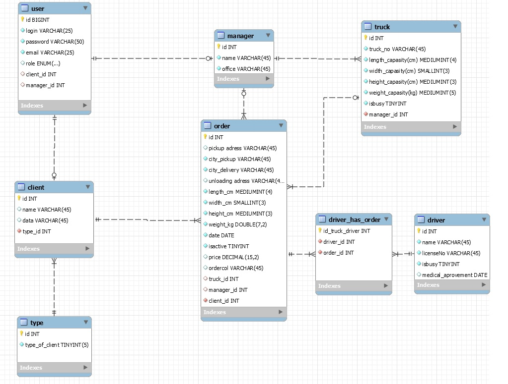

   Приложение представляет собой упрощенную CRM систему для транспортной компаниии.
   
   В данном случае рассматривается организация, занимающаяся перевозками мелких хозяйственных грузов и посылок по трритории Республики Беларусь. Аналогичный пример - российская компания Сdek (https://www.cdek.ru/ru).
   
   Есть 2 роли пользователя: Менеджер и Клиент.
   
   Менеджер представляет собой сотрудника компании, который работает в каком-либо из офисов (городов компании). В качестве этого параметра выступает поле office (только информативное поле, без функционала).
   
   Клиент же представлет собой (физическое лицо, юридическое лицо, либо какой-либо офис самой компании). 
   
   После ввода логина и пароля клиенту предлагается форма запроса стоимости перевозки, где он может ввести параметры груза, города загрузки и выгрузки. (Подразумевается, что адрес вводить не обязательно, т.к. по городу доставка бесплатна, либо товар можно забрать в офисе/складе компании). Нажав кнопку "Рассчитать" - программа рассчитает стоимость перевозки по указанным параметрам, отобразит это на экране и предложит ввести необязательные поля адреса загрузки и выгрузки перед оформлением заказа. Клиент принимает решение редактировать запрос или оформить заказ. Нажав кнопку "оформить", заказ записывается в базу данных. С этого момента менеджер, войдя под своим логином и паролем может увидеть этот заказ по вкладке "запросы". Под запросом понимается заказ, который еще не принял какой-либо конкретный менеджер. Перейдя по кнопке "запросы" и увидев данный заказ, менеджер может его принять, и тогда заказу присваивается manager_id (id ответственного менеджера) и заказ переносится из страницы "запросы" на страницу "заказы". Страница "заказы" - уникальная страница для каждого менеджера, на которой отображаются заказы, которые принял конкретный менеджер. То есть отображается результат запроса в БД по поиску всех заказов, у которых manager_id соответствует текущему менеджеру.
   
   Так же в ведении менеджера имеются некоторые транспортные средства. Каждый менеджер ответственен за отдельный уникальный набор транспортных средтв. И менеджер может назначить машину для определенного заказа.
   
   Менеджер может создавать клиента, добавлять машины. У клиента же такой функционал отсутствует. Клиент ограничен лишь возможностью добавления заказа и просмотра своих заказов.
   
   Проецируя функционал на реальный бизнес - "клиентом" может выступать тот же офис компании в регионах, где с потребителем услуг общается специалист компании, имеющий доступ в систему как клиент. Специалист общается с заказчиком, вводит параметры в систему, получает оплату от потребителя и принимает груз. Менеджером же может выступать инженер по организации перевозок, наблюдающий за заказами в системе и назначающий машины под конкретные заказы в соответствии с характеристиками груза и машины и рассчитывая наиоптимальнейшую загрузку мшаины.
   
   При частом использовании функционала другими компаниями доступ "клиента" может даваться предприятиям напрямую.
   
   Так же имеется роль пользователя водитель (не доработана). Подразумевается, что водитель может быть ответственный за определенный набор заказов и зайдя в систему может видеть какие заказы может забрать на складе.
   
   ​
   